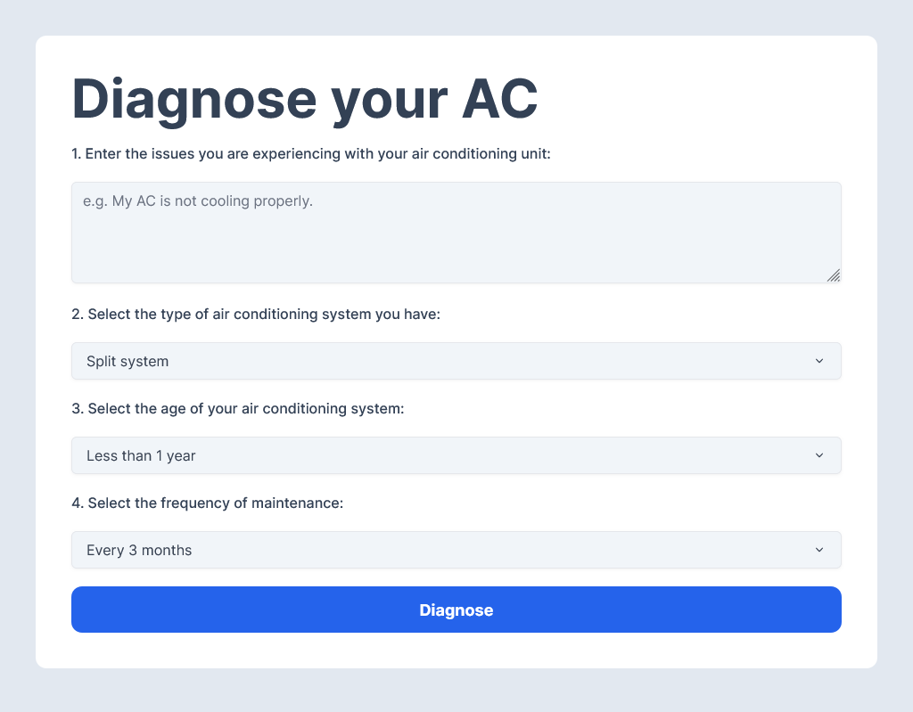

<div align="center">
    <h3 align="center">Diagnose AC</h3>
    <p align="center">
        A user-friendly web application that helps users diagnose issues they are experiencing with their air conditioning unit. Simply provide a description of the problem, and some information on your A/C to receive possible diagnostic and recommendations in seconds.
        <br />
        <br />
        <a href="https://diagnoseac.cyclic.app">View</a>
        ·
        <a href="https://github.com/joselupianez/diagnoseac/issues">Report Bug</a>
        ·
        <a href="https://github.com/joselupianez/diagnoseac/pulls">Request Feature</a>
    </p>
    
</div>

## How It's Made:
This project uses [Upstash](https://github.com/upstash/ratelimit) for serverless rate limiting, [Next.js](https://nextjs.org/), and [OpenAI's GPT-3 API](https://openai.com/blog/chatgpt) to provide a diagnostic for air conditioning systems. When a user enters a description of the problem in the form, the app generates a prompt based on the input data. This prompt is then sent to the GPT-3 API, and then the response is displayed to the user, providing valuable insight and recommendation.

## Tech Used:
[![NextJS][Next.JS]][Tailwind.CSS]
[![NodeJS][Node.JS]][Node.JS]
[![JS][JavaScript]][JavaScript]
[![TailwindCSS][Tailwind.CSS]][Tailwind.CSS]

## Running Locally

Create a `.env` file in config folder and add the following as `key = value`
  - UPSTASH_REDIS_REST_URL = `your upstash rest url`
  - UPSTASH_REDIS_REST_TOKEN = `your upstash rest token`
  - OPENAI_API_KEY = `your openai api key`

Start the development server:
```bash
npm run dev
# or
yarn dev
# or
pnpm dev
```

<!-- MARKDOWN LINKS & IMAGES -->
[Next.JS]: https://img.shields.io/badge/next.js-000000?style=for-the-badge&logo=nextdotjs&logoColor=white
[JavaScript]: https://img.shields.io/badge/javascript%20-%23323330.svg?&style=for-the-badge&logo=javascript&logoColor=%23F7DF1E
[Node.JS]: https://img.shields.io/badge/Node.js-43853D?style=for-the-badge&logo=node.js&logoColor=white
[Tailwind.CSS]: https://img.shields.io/badge/Tailwind_CSS-38B2AC?style=for-the-badge&logo=tailwind-css&logoColor=white
